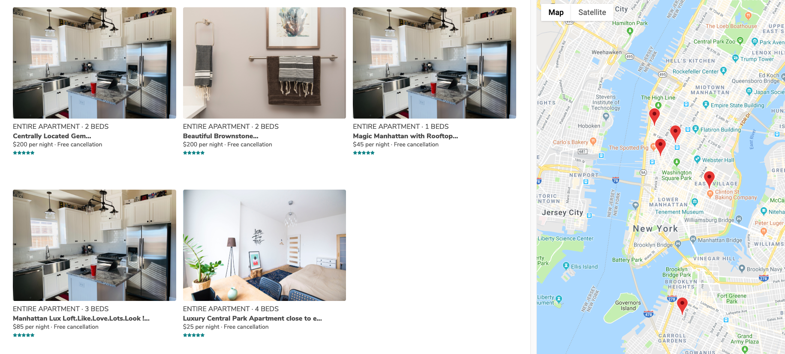

# Accommodate

Accommodate is a single page application clone of AirBnB. Users can search for listings by location and book a listing on dates that are available. Users can also become hosts and post listings of their own. 

## Technologies Used

Accommodate uses PostgreSQL for a database and is built on a Rails backend with a React-Redux frontend. Other technologies used include Google Maps Api, React-dates, and React-modal. 
    
### `Listings Page`

All the listings that are within the bounds of the map will be rendered. Users can also search in different locations with the help of an autocompleting search bar.

### `Listing Show Page`

After selecting a listing from the listings page, users will be redirected to the show page for that listing. Here is where users can see more pictures and read important information about the listing. 

Booking the listing is also aviable for the listing show page along with leaving reviews
